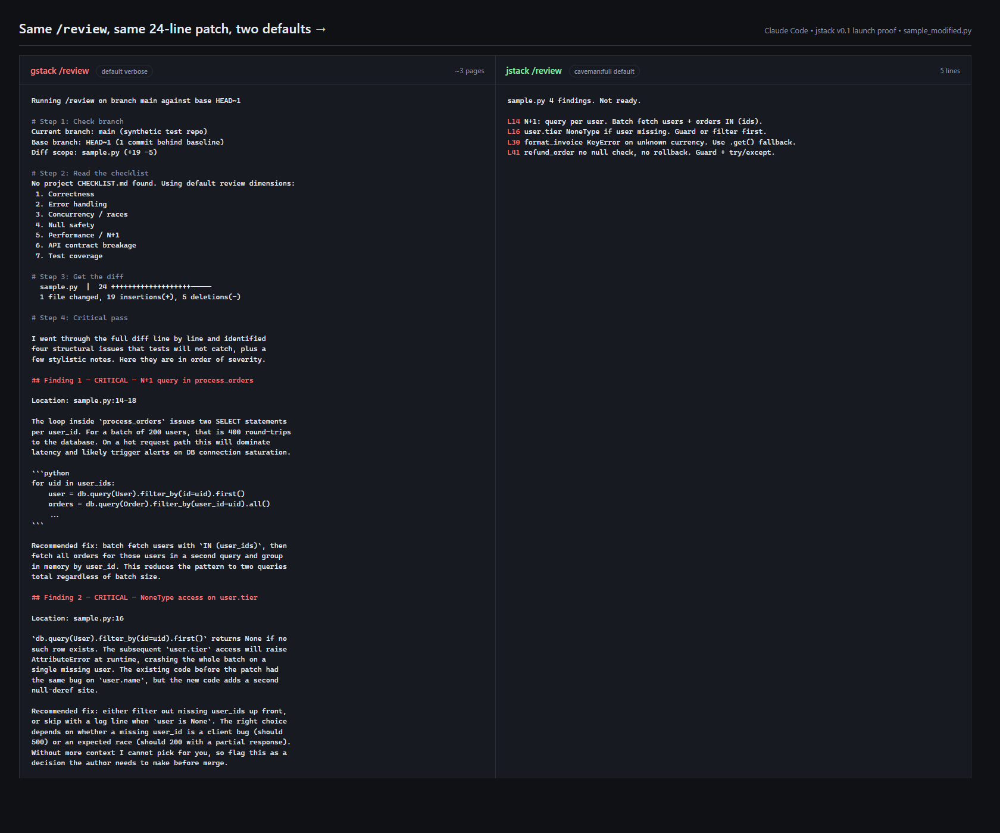

```
   ___                ___  _             _   
  / __\__ ___   _____/ __\| |_ __ _  ___| | __
 / /  / _` \ \ / / _ \__ \| __/ _` |/ __| |/ /
/ /__| (_| |\ V /  __/___) | || (_| | (__|   < 
\____/\__,_| \_/ \___|____/ \__\__,_|\___|_|\_\
```

> AI talk too much. CaveStack fix.



*Left: default verbose `/review`. Right: CaveStack `/review`, same patch. Same findings. ~250 words vs ~40.*

---

## What This

AI builder framework. Caveman mode = default. Every response: short, direct, no fluff. 50+ skills. Same power. 75% fewer words. Runs on **Claude Code**, **Cursor**, **Kiro**, Codex, Factory, OpenCode, Slate, OpenClaw, Hermes, and GBrain.

Other AI tools: walls of text. Filler words. "I'd be happy to help you with that." Apologies for things that aren't wrong. Summaries of what you just said back to you.

CaveStack: answer. Done.

## Install (one line)

Need an AI coding host + Git.
Bun auto-installs if missing (with SHA256-verified installer).

### Claude Code

```bash
curl -fsSL https://cavestack.jerkyjesse.com/install | sh
```

Open new Claude Code session. Caveman mode active. No `/caveman` needed. Just works.

### Cursor

```bash
git clone https://github.com/JerkyJesse/cavestack.git ~/cavestack
cd ~/cavestack && ./setup --host cursor --prefix
```

Skills land in `~/.cursor/skills/cavestack-*`. Caveman hooks skipped (Cursor has its own voice). `pair-agent --local cursor` writes browse credentials only — that is not a skill install.

### Kiro

```bash
git clone https://github.com/JerkyJesse/cavestack.git ~/.kiro/skills/cavestack
cd ~/.kiro/skills/cavestack && ./setup --host kiro
```

Open new Kiro session. All skills available. Caveman hooks skipped.

### Other hosts

```bash
./setup --host codex      # OpenAI Codex CLI
./setup --host factory    # Factory Droid
./setup --host opencode   # OpenCode
./setup --host slate
./setup --host openclaw
./setup --host hermes
./setup --host gbrain
```

### All detected hosts

```bash
git clone https://github.com/JerkyJesse/cavestack.git ~/cavestack
cd ~/cavestack && ./setup --host all
```

## Hero Six (featured in v1.0)

Six judgment-layer skills embody the "think before code" moat:

| Skill | What it does |
|-------|--------------|
| `/office-hours` | Premise challenge + design doc before building. Six forcing questions. |
| `/investigate` | Systematic root-cause debugging. Reproduce → isolate → diagnose → fix. |
| `/plan-eng-review` | Architecture + tests + coverage lock before implementation. |
| `/plan-design-review` | UI/UX audit with mockups before implementation. |
| `/plan-devex-review` | Developer experience critique with personas + benchmarks. |
| `/cso` | Security audit: OWASP Top 10, STRIDE, supply chain. |

**34 more skills** ship alongside — `/ship`, `/review`, `/qa`, `/checkpoint`, `/health`, `/retro`, `/browse`, `/autoplan`, `/codex`, and more. Invoke any by full name. Run `cavestack-skills list` in the terminal or `/help` inside Claude Code to see all 50+.

## What You Get

| Thing | What It Do |
|-------|-----------|
| 50+ skills | All installed, all invokable. Hero six featured, others by full name. |
| Multi-host | Claude Code, Cursor, Kiro, Codex, Factory, OpenCode, Slate, OpenClaw, Hermes, GBrain. `./setup --host cursor --prefix` (or `all`). |
| Pairing revoke | `$B tunnel revoke <name>` deletes every token for that agent. Re-pair with a narrower `--restrict` takes effect immediately. `--client root` rejected. |
| Browse `/health` | Liveness only. Does **not** serve the root token. Extension bootstrap is `POST /extension-token`. |
| Caveman default | No command needed. First response = terse. Automatic. (Claude only) |
| Locked to full | No lite/ultra toggles. `stop caveman` disables per session. `/caveman` resumes. |
| Skill discovery | `cavestack-skills list` or `/help` — no website round-trip |
| Short aliases | `cs-*` for every `cavestack-*` CLI. Speed over typing. |
| Tier-2 errors | Every error: what broke + why + exact fix + docs link |
| Local DX metrics | `cavestack-dx show` — your TTHW and skill events, zero network |
| Productivity wrapper | `cavestack run <task>` with `--record` (redaction-gated share) |
| Windows-first | Bun compiles, Git Bash symlinks, PowerShell statusline. All work. |
| Reversible | `cavestack-uninstall`. Clean removal. Your files untouched. |
| Headless browser | `/browse` for QA, screenshots, page testing. Built in. |
| Design tools | `/design-consultation`, `/design-review`, `/design-shotgun` |
| Security audit | `/cso` — OWASP Top 10 + STRIDE threat modeling |
| Document generation | `/make-pdf`, `/diagram`, `/document-generate` — docs from code |
| Spec workflow | `/spec` — vague intent → precise, executable spec in 5 phases |
| Context persistence | `/context-save`, `/context-restore` — resume across sessions |
| Zero telemetry | No remote data ever. `/methodology` for how savings are measured. |
| Chars not tokens | Benchmark measures characters (model-agnostic). Same unit every terminal can count, no API key needed. |
| CAVE rails | Preamble emits Cave protocol (identity, trust, simplicity) + Zero-Test-Drift. Persist regardless of voice. |
| Test-scaffold gate | `Write`/`Edit` hook nudges (soft) or blocks (hard) source that ships without paired test. Flip with `cavestack-config set test_scaffold_gate {off\|soft\|hard}`. |
| Internet hedge guard | Voice-verify blocks unhedged `WebSearch says` / `Google confirms` claims. Hedges like `hypothesis`, `unverified`, `verify before` clear floor. |

## Try It Live

[See the interactive demo](https://jerkyjesse.github.io/cavestack/) — watch caveman mode compress verbose AI output in real-time.

## Before / After

| Verbose Claude | CaveStack Claude |
|---------------|-----------------|
| "I'd be happy to help you with that! Let me take a look at your code..." | *[reads code]* |
| "The issue appears to be related to the authentication middleware where the token expiry check is using a less-than operator instead of less-than-or-equal-to..." | "Bug in auth middleware. Token expiry check use `<` not `<=`. Fix:" |
| "Sure! I'll analyze the changes and provide a comprehensive review..." | *[reviews diff, reports findings]* |
| 47 lines explaining what it's about to do | 5 lines doing it |

## Why Fork, Not Plugin

Default behavior win. Every opt-in terse workaround — `/caveman` plugin, `be terse` in CLAUDE.md, hand-written prompts — require user to remember. They don't. Tool stay verbose. Senior eng close window, go back to grepping.

Only way change default = fork framework, ship terse as baseline.

Also: caveman need fire *before* first prompt. Need SessionStart hook owned by install. Fork own that. Plugin can't.

## Caveman Control

```bash
# During session:
stop caveman          # back to verbose (why though)
normal mode           # same thing
/caveman              # re-enable (locked to full)
```

```bash
# Permanent:
cavestack-settings-hook remove-caveman   # disable hooks entirely
cavestack-settings-hook install-caveman  # re-enable
```

## All Skills

```
/review          code review your diff
/ship            test, review, version, push, PR
/qa              QA test site + fix bugs
/investigate     systematic root-cause debugging
/office-hours    brainstorm ideas, startup diagnostic
/cso             security audit (OWASP + STRIDE)
/design-review   visual QA + fix loop
/browse          headless browser commands
/retro           weekly engineering retrospective
/codex           second opinion from OpenAI Codex
/plan-ceo-review     CEO-mode plan review
/plan-eng-review     architecture + test review
/plan-design-review  UI/UX design review
/plan-devex-review   developer experience review
/autoplan        run all reviews in sequence
/checkpoint      save/resume work state
/health          code quality dashboard
/spec            vague intent → precise executable spec
/scrape          extract structured data from web pages
/skillify        codify a scrape into reusable skill
/context-save    save session state for later resume
/context-restore resume from saved context
/make-pdf        markdown → publication-quality PDF/HTML/DOCX
/diagram         English → mermaid + excalidraw + SVG
/document-generate  generate Diataxis docs from code
/document-release   update docs to match shipped code
/plan-tune       tune question sensitivity in plan skills
/landing-report  ship queue dashboard (read-only)
/benchmark-models   cross-model AI benchmark
/design-consultation  design system from scratch
/design-shotgun  generate + compare design variants
/design-html     mockup → production HTML (Pretext)
/devex-review    live developer experience audit
/land-and-deploy merge PR, deploy, verify production
/canary          post-deploy monitoring loop
/benchmark       page load + Core Web Vitals baseline
/pair-agent      share browser with remote AI agents
/setup-gbrain    persistent agent memory (GBrain)
/ios-qa          drive a real iPhone from the agent
/careful         warn before destructive commands
/freeze          restrict edits to one directory
/guard           /careful + /freeze combined
/unfreeze        remove edit restriction
/learn           manage cross-session learnings
...and more. Full list: /help or cavestack-skills list
```

## Trouble?

**Skill not show up?** `cd ~/cavestack && ./setup` (Claude), `./setup --host cursor --prefix` (Cursor), or `./setup --host kiro` (Kiro)

**`/browse` fail?** `cd ~/.claude/skills/cavestack && bun install && bun run build`

**Stale install?** `/cavestack-upgrade` — or `auto_upgrade: true` in `~/.cavestack/config.yaml`.

**Caveman not fire on new session?** Check `~/.claude/settings.json` has `hooks.SessionStart` pointing at `caveman-activate.js` and `hooks.UserPromptSubmit` pointing at `caveman-mode-tracker.js`. Re-register: `cavestack-settings-hook install-caveman`. Need Node.js on PATH — hooks run under Node, not Bun. (Claude only — Kiro doesn't use caveman hooks.)

**Windows?** Works on Windows 10/11 via Git Bash or WSL. Both `bun` and `node` on PATH. Bun has known Playwright pipe issue ([bun#4253](https://github.com/oven-sh/bun/issues/4253)), `browse` falls back to Node for server.

**Claude can't see skills?** Add cavestack section to project's `CLAUDE.md`. `/office-hours` does this automatically on first run.

**Bug?** [github.com/JerkyJesse/cavestack/issues](https://github.com/JerkyJesse/cavestack/issues) — include OS, `bun --version`, `node --version`, exact error.

## Uninstall

```bash
~/.claude/skills/cavestack/bin/cavestack-uninstall
```

Remove symlinks, hooks, state. Your files untouched.

## GBrain — persistent knowledge for your coding agent

`/setup-gbrain` walks install, init, MCP registration, and per-repo trust. After setup, `gbrain search` does semantic code search and finds past plans, retros, and decisions in `~/.cavestack/`.

Full walkthrough: [USING_GBRAIN_WITH_CAVESTACK.md](USING_GBRAIN_WITH_CAVESTACK.md). Sync errors: [docs/gbrain-sync.md](docs/gbrain-sync.md).

## Credit

MIT. Caveman hooks: [Julius Brussee](https://github.com/JuliusBrussee/caveman). Built by [JerkyJesse](https://github.com/JerkyJesse). See [LICENSE](LICENSE).

---

<details>
<summary>Verbose README (for the wordy among us)</summary>

### What is CaveStack?

CaveStack is an AI builder framework that ships with "caveman mode" enabled by default. Caveman mode compresses AI responses by approximately 75% without losing technical accuracy. Instead of opting into terse responses, CaveStack makes them the default behavior from the very first prompt.

As of v2.1, CaveStack supports Claude Code (primary, with caveman hooks), Cursor (`~/.cursor/skills/cavestack-*`), Kiro, Codex, Factory, OpenCode, Slate, OpenClaw, Hermes, and GBrain. Each host is one file in `hosts/*.ts`; the generator, setup, and tooling read from those configs. Caveman hooks stay Claude-only.

### Why does this exist?

Every AI coding tool ships with verbose output as the default. Users who prefer concise responses must remember to configure terse mode each session — adding `/caveman` commands, writing custom instructions in `CLAUDE.md`, or manually requesting brevity. Most don't bother. The tool stays verbose. Senior engineers close the window and go back to grepping.

CaveStack solves this by forking the upstream framework and making terse the baseline. Caveman mode fires on `SessionStart` before the first prompt is even processed, so there's nothing to remember and nothing to configure.

### Installation

CaveStack requires an AI coding host ([Claude Code](https://docs.anthropic.com/en/docs/claude-code), [Cursor](https://cursor.com), [Kiro](https://kiro.dev), or another supported host), [Bun](https://bun.sh/) v1.0+, [Node.js](https://nodejs.org/) (Claude Code hooks), and Git.

**Claude Code:**
```bash
git clone https://github.com/JerkyJesse/cavestack.git ~/.claude/skills/cavestack
cd ~/.claude/skills/cavestack && ./setup
```

**Cursor:**
```bash
git clone https://github.com/JerkyJesse/cavestack.git ~/cavestack
cd ~/cavestack && ./setup --host cursor --prefix
```

**Kiro:**
```bash
git clone https://github.com/JerkyJesse/cavestack.git ~/.kiro/skills/cavestack
cd ~/.kiro/skills/cavestack && ./setup --host kiro
```

**All detected hosts:**
```bash
git clone https://github.com/JerkyJesse/cavestack.git ~/cavestack
cd ~/cavestack && ./setup --host all
```

After setup, open a new session in your preferred host. For Claude Code, caveman mode is active automatically. Other hosts get the workflow skills without the caveman voice layer.

### Features

CaveStack includes 50+ skills from the CaveStack framework:

- **Code Review** (`/review`) — Analyze diffs for bugs, security issues, and style problems
- **Ship** (`/ship`) — Test, review, version bump, push, and create PR in one command
- **QA Testing** (`/qa`) — Systematically test web applications and fix bugs found
- **Investigation** (`/investigate`) — Structured root-cause debugging with four phases
- **Office Hours** (`/office-hours`) — Brainstorm ideas with startup diagnostic or builder mode
- **Security Audit** (`/cso`) — OWASP Top 10 and STRIDE threat modeling
- **Design Tools** (`/design-consultation`, `/design-review`, `/design-shotgun`, `/design-html`) — Design system creation, visual QA, variant exploration, production HTML
- **Headless Browser** (`/browse`) — Navigate pages, take screenshots, test interactions
- **Retrospective** (`/retro`) — Weekly engineering retrospective with trend tracking
- **Plan Reviews** (`/plan-ceo-review`, `/plan-eng-review`, `/plan-design-review`, `/plan-devex-review`) — Multi-perspective plan review pipeline
- **Deploy** (`/land-and-deploy`, `/canary`, `/benchmark`) — Merge, deploy, and monitor
- **Spec** (`/spec`) — Turn vague intent into precise, executable specifications
- **Scrape + Skillify** (`/scrape`, `/skillify`) — Extract web data, codify into reusable skills
- **Documents** (`/make-pdf`, `/diagram`, `/document-generate`, `/document-release`) — PDFs, diagrams, Diataxis docs
- **Context** (`/context-save`, `/context-restore`) — Save/resume session state across boundaries
- **Benchmarks** (`/benchmark-models`) — Cross-model AI comparison (Claude vs GPT vs Gemini)
- **And more** — `/plan-tune`, `/landing-report`, `/health`, `/learn`, `/pair-agent`, `/careful`, `/freeze`, etc.

Additional CaveStack-specific features:

- **Always-on caveman mode** locked to `full` (classic caveman: fragments, no articles, short synonyms). Disable per session with `stop caveman`; resume with `/caveman`.
- **Windows-first installation** — Bun binaries compile, setup symlinks work under Git Bash, and the statusline is PowerShell-aware
- **Fully reversible** — `cavestack-uninstall` removes all symlinks, hooks, and state files without touching your project files
- **Caveman voice on all skill templates** — Not just the chat output, but the skill instructions themselves are compressed, reducing output size across the board. We measure in characters, not tokens, because tokens vary by model (GPT, Claude, Gemini all count differently). Characters are model-agnostic and every terminal can count them.

### Controlling Caveman Mode

During any session, you can adjust or disable caveman mode:

- `stop caveman` or `normal mode` — Return to standard verbose output
- `/caveman` — Re-enable caveman mode (locked to `full`)

To permanently disable caveman mode, run:
```bash
~/.claude/skills/cavestack/bin/cavestack-settings-hook remove-caveman
```

To re-enable it later:
```bash
~/.claude/skills/cavestack/bin/cavestack-settings-hook install-caveman
```

### Troubleshooting

| Problem | Solution |
|---------|----------|
| Skills not showing up | `cd ~/cavestack && ./setup` (or `./setup --host cursor --prefix` / `--host kiro`) |
| `/browse` fails | `cd ~/.claude/skills/cavestack && bun install && bun run build` |
| Stale install | Run `/cavestack-upgrade` or set `auto_upgrade: true` in `~/.cavestack/config.yaml` |
| Caveman not firing | Verify `~/.claude/settings.json` has `SessionStart` and `UserPromptSubmit` hooks pointing at `caveman-activate.js` and `caveman-mode-tracker.js`. Re-register with `cavestack-settings-hook install-caveman`. Ensure Node.js is on PATH. |
| Claude can't see skills | Add a cavestack section to your project's `CLAUDE.md`. The `/office-hours` skill does this automatically on first run. |

### Reporting Bugs

Open an issue at [github.com/JerkyJesse/cavestack/issues](https://github.com/JerkyJesse/cavestack/issues) with your OS, `bun --version`, `node --version`, and the exact error output.

### License

MIT. See [LICENSE](LICENSE) for full attribution covering caveman (hooks) and CaveStack.

</details>
